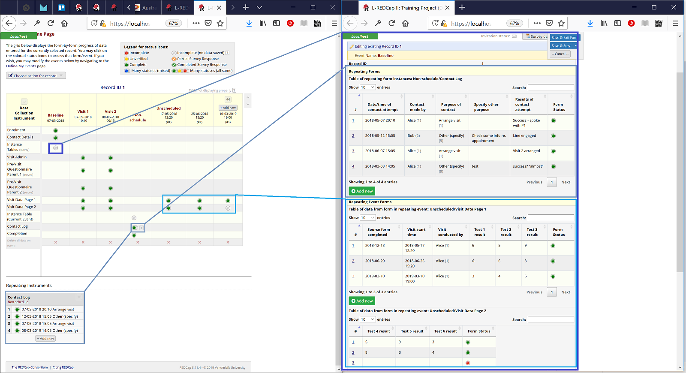

# REDCap External Module: Instance Table

Use the action tag `@INSTANCETABLE=form_name` in a descriptive text field to include a table showing data from repeat instances of that form.

If project is longitudinal, use `@INSTANCETABLE=event_name:form_name` to specify the event and form (can be a repeating form or a form in a repeating event). Event defaults to current event if not specified.

* Add or Edit instances in popup window (View only if user has read-only permission for the repeating form).
* Uses DataTables to facilitate sorting, search and paging within the table of instance data.
* Does not show table for users with no read permission to the repeating form.
* Displays in both regular data entry and survey forms.
* Survey view is read only with no links to the form instances.
* Adds an entry for `@INSTANCETABLE` into the Action Tags dialog on Project Setup and Online Designer pages.

## Additional Action Tags
### Tags Used Alongside @INSTANCETABLE
* `@INSTANCETABLE_SCROLLX`: Default behaviour is for a wide table to cause its container to grow. Use this tag to get a horizontal scroll-bar instead.
* `@INSTANCETABLE_HIDEADD`: Suppress the "Add New" button.
* `@INSTANCETABLE_PAGESIZE`: Override default choices for page sizing: specify integer default page size, or -1 for "All".
* `@INSTANCETABLE_HIDEINSTANCECOL`: Hide the "#" column containing instance numbers.
* `@INSTANCETABLE_VARLIST=rptfrmvar1,rptfrmva2,rptfrm_complete`: Include only the variables from the repeating form that appear in the comma-separated list. (An alternative to using `@INSTANCETABLE_HIDE` for repeating form variables. `@INSTANCETABLE_HIDE` takes precedence where both used.)
* `@INSTANCETABLE_REF=fieldname`: Where you have an instance table on a repeating form - i.e. is referencing another repeating form - you can have the instances filtered to show only those where the current instance number is saved in a field on the other form. For example, an instance table in a repeating "Visit" form may be configured to show only instances of the repeating "Medication" form where the current Visit instance is selected in the `visitref` field on the Medication form: `@INSTANCETABLE @INSTANCETABLE_REF=visitref`. Note that if you use `@INSTANCETABLE_REF` for an instance table on a non-repeating form the filter will default to `<ref field>=1`. New instances created by clicking the "Add New" button below the instance table will have the current visit instance pre-selected.

### Tags Used for Fields on a Repeating Form 
* `@INSTANCETABLE_HIDE`: Ignore this field in instance all tables.
* `@INSTANCETABLE_LABEL='column header'`: Provide an alternative column title for the field in all instance tables.

## Example 
This example shows (on the right-hand side) a form containing three descriptive text fields utilising the `@INSTANCETABLE` action tag. 
* The first is tagged `@INSTANCETABLE=nonschedule_arm_1:contact_log` and hennce displays a table of data from the "Contact Log" form in the "Nonschedule" event".
* The second is tagged `@INSTANCETABLE=unscheduled_arm_1:visit_data_page_1` and hence displays a table of data from the "Visit Data Page 1" form from the repeating "Unscheduled event.
* The third is tagged `@INSTANCETABLE=unscheduled_arm_1:visit_data_page_2` and hence displays a table of data from the "Visit Data Page 2" form from the repeating "Unscheduled event.

